## 🏴‍☠️ **Takım İsmi**

**One Piece** 

## 👥 Takım Üyeleri

<table>
  <tr>
    <th></th>
    <th>Name</th>
    <th>Title</th>
    <th>Socials</th>
  </tr>
  <tr>
    <td></td>
    <td>Kutay Perk</td>
    <td>Product Owner</td>
    <td>
      <a href="https://github.com/Ktyprk">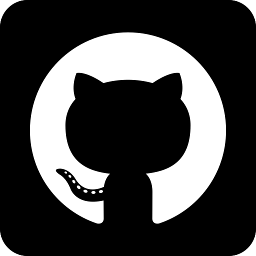</a>
      
    </td>
  </tr>
  <tr>
    <td>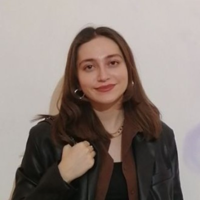</td>
    <td>Melike Şahin</td>
    <td>Scrum Master</td>
    <td>
      
      
    </td>
  </tr>
  <tr>
    <td>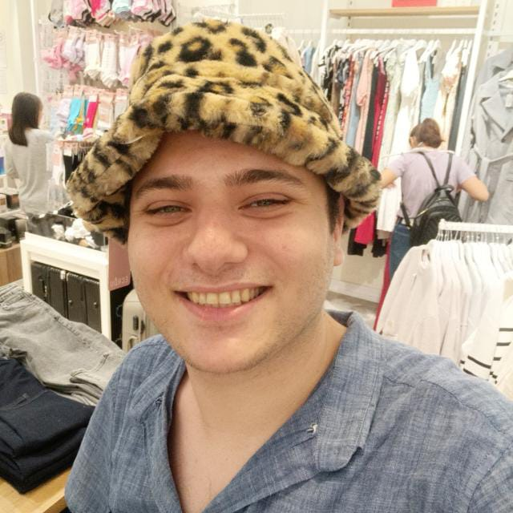</td>
    <td>Mirza Özmen</td>
    <td>Game Developer</td>
    <td>
      
      
    </td>
  </tr>
  <tr>
    <td>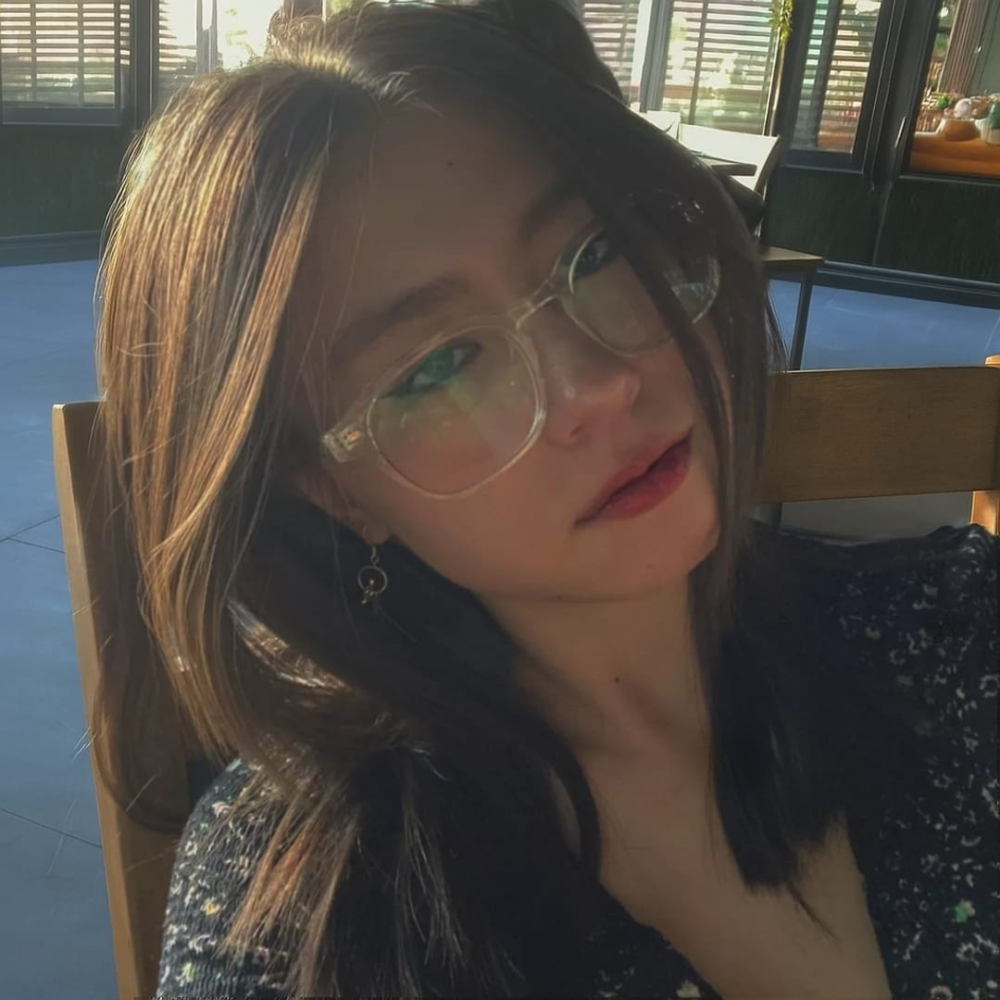</td>
    <td>Ecenur Ektaş</td>
    <td>Game Developer</td>
    <td>
      
      
    </td>
  </tr>
  <tr>
    <td>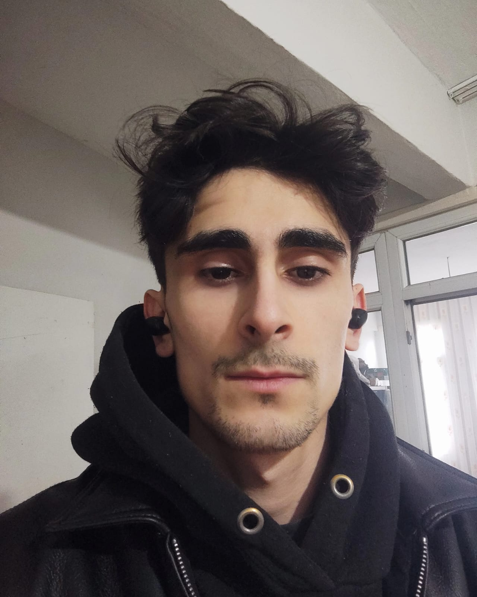</td>
    <td>Harun Avaş</td>
    <td>Game Developer</td>
    <td>
      
      
    </td>
  </tr>
</table>

## 🎮 Oyun İsmi

**FUNGOR**

## 🎮 Oyun Logosu
  

  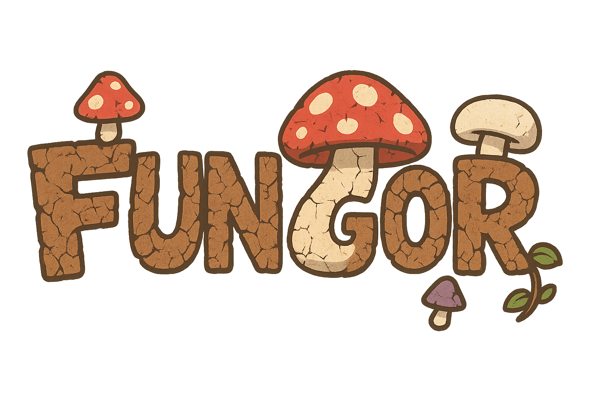
  

## 📝 Oyun Açıklaması

**Fungor**, terk edilmiş bir zindanda mantar salgınının kaynağına doğru ilerleyen Arthur’un karanlık ve tehlikeli yolculuğunu konu alan, 3D izometrik rogue benzeri bir aksiyon-macera oyunudur.
Her denemede farklılaşan düşmanlar ve keşfedilecek sırlarla dolu zindan katmanlarında, hem hayatta kalmaya hem de kaçışın anahtarını bulmaya çalış!

## 📖 Oyun Hikayesi

Arthur eski bir zindanda bir mahkumdur. Zindanın derinliklerinde eski mahkumların çürümeye bırakılan cesetleri sebebiyle bir mantar salgını başlamış ve buradaki gardiyanlar kendi canlarını kurtarmak için zindanı terk etmişlerdir. Geride yalnızca Arthur ve yaşlı, unutulmuş bir adam kalmıştır. Bu yaşlı adam ne adını ne de geçmişini hatırlar ancak emin olduğu tek bir şey vardır: bu kabusun bitmesinin tek yolu zindanın derinliklerinde yatıyordur. Gücünü yitirmiş bu yaşlı adam, kaçamayacak kadar yaşlı olsa da, Arthur’a bir teklifte bulunur — birlikte çalışırlarsa, belki kurtuluş bir ihtimaldir.

Hayatta kalmak ve özgürlüğe ulaşmak için Arthur’un tehlikelerle dolu bu zindanın katmanlarında ilerlemesi, düşmanlarla yüzleşmesi ve gizemi çözmesi gerekmektedir. Her adımda yeni tehditler, her köşede yeni sırlar… Zindan seni yutmaya hazır. Peki ya sen çıkmaya hazır mısın?

## 🛠️ Oyun Özellikleri

- 3D Izometrik
- Tek Oyunuculu
- Action/Macera
- Rogue Benzeri

## 🎯 Hedef Kitle

- Rogue Benzeri Oyunlar severler
- Bağımsız (İndie) Oyun severler
- 15- 35 yaş arası oyuncular

## 📢 Pazarlama Planı

- Twitter/X, Instagram, TikTok’ta konsept çizimler ve geliştirici içerikleri paylaşmak.
- Discord sunucusu kurarak erken takipçilerle doğrudan iletişim kurmak.
- Steam Next Fest ve itch.io’da kısa bir demo yayımlayarak geri bildirim toplamak.
- Küçük-orta ölçekli yayıncılara erken sürüm sağlamak.
- #Fungor etiketiyle topluluğu içerik üretmeye teşvik etmek.
- Steam ve sosyal medya platformlarında fragmanla birlikte lansmanı duyurmak.

## 📌 Product Backlog URL

[Notion Backlog Board](https://furry-typhoon-ba9.notion.site/21ff217f7c0780c88cffc16a281e1b2a?v=21ff217f7c0780f3b6c7000cf3c73045)

## 📜 Game Design Document (GDD)
- Projenin tüm tasarım detaylarını, mekaniklerini ve görsel–işitsel öğelerini planladığımız; notlarımızı, fikirlerimizi ve taslaklarımızı bir araya getirdiğimiz dokümandır.
[Notion Game Design Document](https://furry-typhoon-ba9.notion.site/Game-Design-Document-228f217f7c0780bca292ea4def488071?source=copy_link)
---

# 🚀 Sprint 1

- **Sprint Notları** : User Story'ler product backlog'ların içine yazılmıştır. Product backlog item'lara tıklandığında hikayelerin detayları okunabilmektedir.

- **Sprint içinde tamamlanması tahmin edilen puan** : 100 Puan

- **Puan tamamlama mantığı** : Proje boyunca tamamlanması gereken toplam 300 puanlık backlog bulunmaktadır. 3 sprinte bölündüğünde ilk sprintin 100 ile başlaması gerektiği kararlaştırıldı.

- **Backlog düzeni ve Story seçimleri** : Backlog’umuz, projenin tüm ihtiyaçlarını kapsayacak şekilde Notion’daki Task Tracker board’unda detaylı olarak oluşturulmuştur.Görevler, sprintlerin yapısına uygun olarak aşağıdaki sütunlarda yönetilmektedir:
Not Started: Henüz başlanmamış, planlanan ve backlog’a eklenen görevler,
In Progress: Aktif olarak üzerinde çalışılan görevler,
In Test: Geliştirmesi tamamlanıp test veya review aşamasına alınan görevler,
Done: Tamamlanmış ve kabul edilmiş görevler.

- **Daily Scrum** : Daily Scrum toplantılarının Discord üzerinden yapılması kararlaştırılmıştır. Daily Scrum toplantılarımız ve günlük Whatsapp konuşmalarımız Imgur'da toplanmıştır : [Sprint 2 - Daily Scrum Meetings](https://imgur.com/a/xYQIZTb)
- **Sprint Board Updates** : 
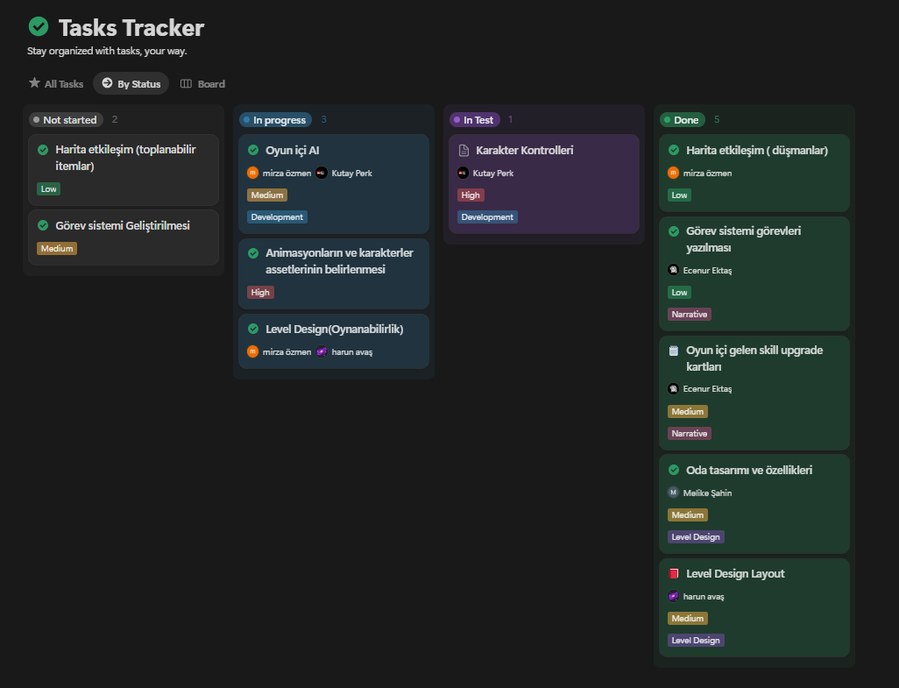

 
• <b>Oyun Durumu: Ekran Görüntüleri : </b>

  
  

  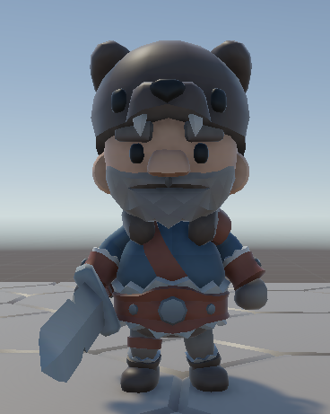
  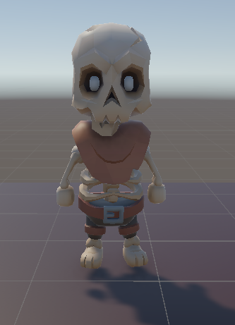
  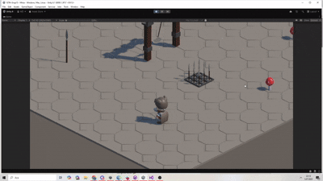
  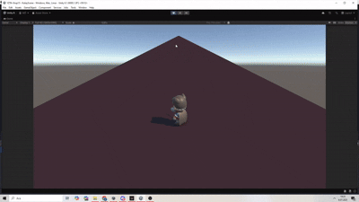
  

  
  

- **Sprint Review** : 

   🎯 Sprint Hedefi
  
    Oyunun ilk prototipini ( hikaye, level design)  oluşturmak ve temel dövüş mekaniğini geliştirmek.
  
   ✨ Tamamlanan İşler
  
    Bütün ekip projede hangi kısımların bittiğini ve bunun hakkındaki görüşlerini iletti. Oyunun güncel tasarımının ve gidişatının beğenildiği belirtildi ve devamı    üzerine yeni fikirler ortaya atıldı. Sprint      içerisinde tasarlanmış olan level tüm ekip tarafından oynandı, herhangi bir sorun ile karşılaşılmadı.
    Ana karakter (Arthur) için temel hareket sistemi
    Düşman AI’larının ilk versiyonu
    İlk test GIF’lerinin kaydedildi.
  
   ⚠️ Tamamlanamayan / Eksik Kalanlar
  
    Ses efektleri, müzik entegrasyonu, basit zindan tasarımı ve düşman çeşitliliği (şu anda sadece tek tip) henüz eklenmedi.

   Sprint Review katılımcıları: Melike Şahin, Ecenur Ektaş, Kutay Perk, Mirza Özmen, Harun Avaş.

- **Sprint Retrospective** :

    ✅ **İyi Gidenler**
    
     Takım içi iletişim ve günlük sprint toplantıları çok verimliydi. Hareket ve dövüş mekaniği hızlıca test edilebilecek seviyeye geldi. Notion board ile backlog yönetimi çok düzenli ilerledi. Github ile proje       üstünde ortak çalışma ortamı oluşturuldu.
    
    🔄 **İyileştirilmesi Gerekenler**
    
     Asset toplama ve tasarım süreci beklenenden uzun sürdü. Kod tarafında branch yönetiminde bazı karışıklıklar yaşandı.
    
    📝**İlerleme Planı**
    
     Demo için giriş menüsü ve UI prototipi, oyunun core loopunu oynanabilir hale getirme ve düşman çeşitliliği eklenmesi planlanmaktadır.

  --------------------------------------------------------------------------------------------------------------------------------------------------------------------------------------------------------

  # 🚀 Sprint 2

- **Sprint Notları** : User Story'ler product backlog'ların içine yazılmıştır. Product backlog item'lara tıklandığında hikayelerin detayları okunabilmektedir.

- **Sprint içinde tamamlanması tahmin edilen puan** : 90 Puan

- **Puan tamamlama mantığı** : Proje boyunca tamamlanması gereken toplam 300 puanlık backlog bulunmaktadır. 3 sprinte bölündüğünde ikinci sprintin 100 ile bitmesi gerektiği kararlaştırıldı.

- **Backlog düzeni ve Story seçimleri** : Backlog’umuz, projenin tüm ihtiyaçlarını kapsayacak şekilde Notion’daki Task Tracker board’unda detaylı olarak oluşturulmuştur.Görevler, sprintlerin yapısına uygun olarak aşağıdaki sütunlarda yönetilmektedir:
Not Started: Henüz başlanmamış, planlanan ve backlog’a eklenen görevler,
In Progress: Aktif olarak üzerinde çalışılan görevler,
In Test: Geliştirmesi tamamlanıp test veya review aşamasına alınan görevler,
Done: Tamamlanmış ve kabul edilmiş görevler.

- **Daily Scrum** : Daily Scrum toplantılarının Discord üzerinden yapılması kararlaştırılmıştır. Daily Scrum toplantılarımız ve günlük Whatsapp konuşmalarımız Imgur'da toplanmıştır : [Sprint 1 - Daily Scrum Meetings](https://imgur.com/a/cuci0KT)
- **Sprint Board Updates** : 
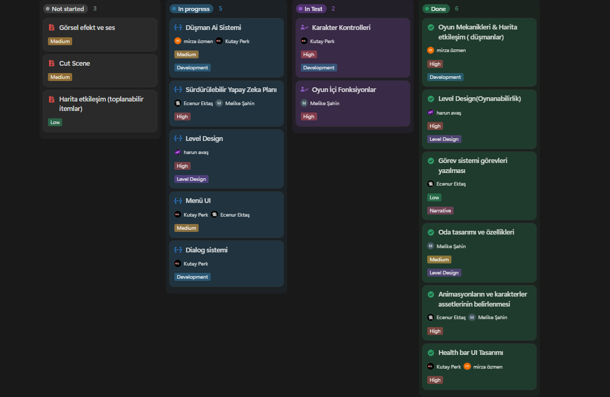

 
• <b>Oyun Durumu: Ekran Görüntüleri : </b>

  
  

  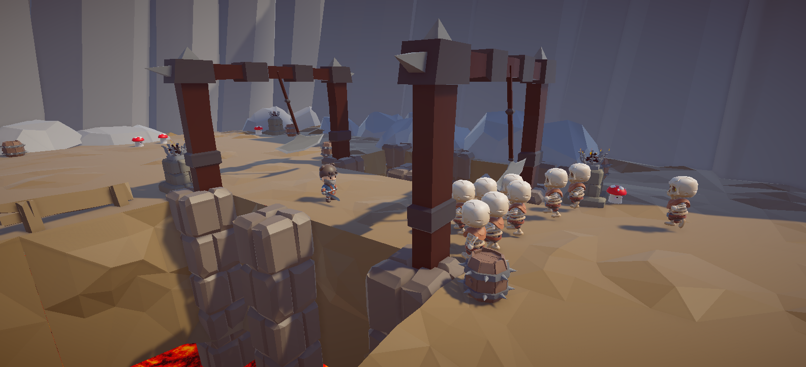
  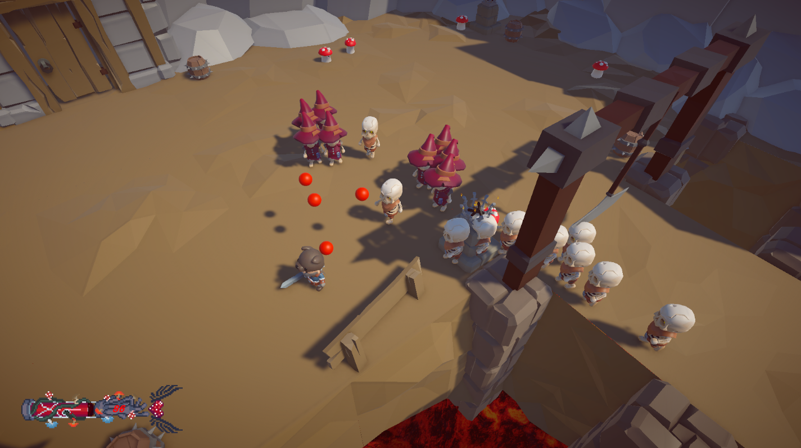
  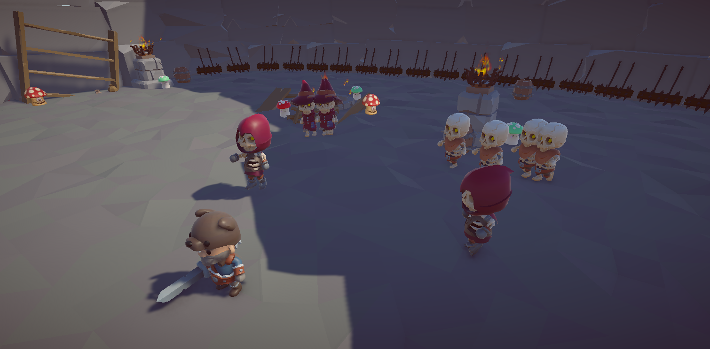
  
  
  

  
  

- **Sprint Review** : 

   🎯 Sprint Hedefi
  
    Bu sprintteki temel hedefimiz, planladığımız üç adet level’ı tasarlamak ve mevcut oyun mekaniklerini bu level’lara entegre etmekti. Aynı zamanda oyun içi kullanıcı arayüzünü (Game UI) oluşturarak oyunu genel     olarak bitirmek.
  
   ✨ Tamamlanan İşler
  
    İki level tasarımı başarıyla tamamlandı ve oynanabilir hale getirildi. Health bar kullanıcı arayüzü tasarlanarak oyuna entegre edildi. Patlayan varil eklendi ve mantar asset’leri yenileriyle değiştirildi.        Ayrıca Rogue dusman(ustumuze ziplayarak hasar veren bir dusman) ve ranged(menzilli) düşman eklendi. 
  
   ⚠️ Tamamlanamayan / Eksik Kalanlar
  
    3.Level tasarımına başlandı ancak sprint süresi içerisinde tamamlanamadı. Harita tasarımında bazı öğelerin entegrasyonu ve düzenlemesi bir sonraki sprinte ertelendi.

   Sprint Review katılımcıları: Melike Şahin, Ecenur Ektaş, Kutay Perk, Mirza Özmen, Harun Avaş.

- **Sprint Retrospective** :

    ✅ **İyi Gidenler**
    
     Ekip içi iletişim oldukça verimliydi ve görev dağılımı net şekilde yapıldığı için planlanan işlerin çoğu zamanında tamamlandı. Test işlemleri başarılı sonuçlandı. Özellikle level tasarımları ve UI
     entegrasyonu ekip üyeleri arasında etkili bir iş birliği ile hızlı ilerledi. Yeni düşman tipinin mekanik olarak sorunsuz entegre edilmesi ve 2 level tasarımının eksiksiz tamamlanması bu sprintteki güçlü          yönlerden biri oldu.
    
    🔄 **İyileştirilmesi Gerekenler**
    
     Bazı görevlerde yeterli zaman planlaması yapılmadığı için sprint sonunda eksik kalan işler oldu. Özellikle asset değişimi sonrası yapılan testlerde zaman kaybı yaşandı. Ayrıca, oyun içinde kullanılacak bazı      UI öğeleri (game over ekranı, ses efektleri) planlamaya dahil edilse de aktif geliştirmeye başlanamadı.
    
    📝**İlerleme Planı**
    
     3.Level tasarımı tamamlanacak ve oyun deneyimini destekleyecek Menü UI, ses efektleri, cut scene geçişleri ve game over ekranı gibi öğelerin tasarım ve entegrasyonu gerçekleştirilecek. 

